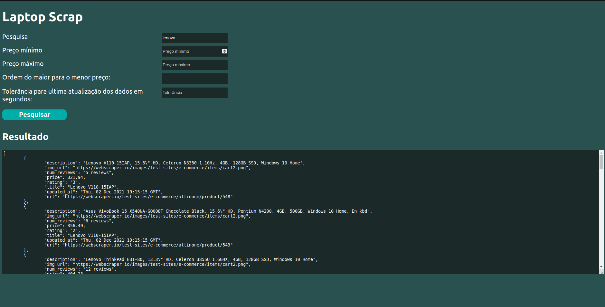

# Laptop Scrapper

Este é um projeto de uma API com web scrapping usando Selenium para automatizar as buscas de informações e Flask para servir as informações, desenvolvido para o processo seletivo da Devnology

## Requisitos Funcionais

- ✅ buscar por um notebook (da marca Lenovo) em uma página web por meio de raspagem de dados usando python
- ✅ como padrão, ordenar preços do menor para o maior

## Requisitos Não Funcionais

- ✅ receber uma palavra chave relacionada ao título do produto
- ✅ poder alterar ordenação por meio de query params
- ✅ a cada busca salvar tudo em um banco de dados local
- ✅ poder receber flag que permite a busca no banco de dados (com tolerância de tempo) ao invés da raspagem
- ✅ utilizar selenim ou puppeteer
- ✅ receber parametros de preço minimo e maximo

## Banco de Dados

- id [PK]
- title
- description
- price
- url
- img_url
- rating
- num_reviews

## Como usar

### Instalação

Para instalar, siga o passo a passo:

```bash
git clone git@github.com:gustadsg/laptop_scrapper.git # fazer o download do projeto
cd laptop_scrapper # entrar no diretório do projeto
pip install -r requirements.txt # instalar dependências
python create_database.py # criar o banco de dados
flask run # inicia o servidor em http://localhost:5000
```

### Rotas

<ol>
  <li>
    <details>
      <summary>Rota de scrapping</summary>
      <div>
        <h3>/api</h3>
        <h4>Parâmetros (query params)</h4>
        <ul>
          <li>
            q: texto que deve estar contido no título ou descrição do produto
          </li>
          <li>
            min_price: preço mínimo do produto
          </li>
          <li>
            max_price: preço máximo do produto
          </li>
          <li>
            reverse: produtos vêm ordenados de maior para menor preço quando este parâmetro é verdadeiro. Quando este parâmetro é Falso ou não enviado o resultado é ordenado de menor para maior preço
          </li>
          <li>
            update_tolerance: tempo máximo em segundos aceitável da última atualização. A depender do estado do banco de dados e do update_tolerance não será feito um novo scrapping e os dados fornecidos serão providos diretamente do banco de dados.
          </li>
        </ul>
      </div>
    </details>
  </li>
  <li>
    <details>
      <summary>Rota de Playground</summary>
      <div>
        <h3>/</h3>
        <h4>Funcionamento</h4>
        <p>Essa é uma rota com interface visual simples que permite o teste da aplicação. Acesse-a e altere os valores dos inputs para receber os dados correspondentes obtidos da rota /api</p>
        
      </div>
    </details>
  </li>
</ol>
